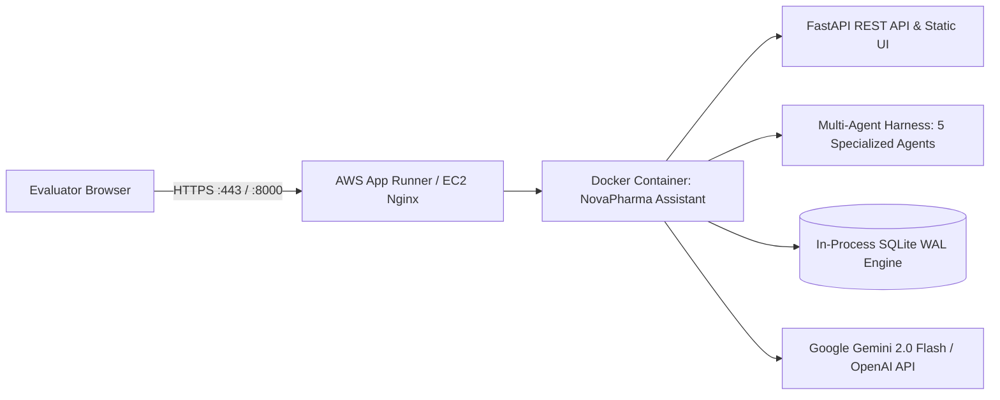

# 🚀 NovaPharma Commercial Analytics AI - AWS Deployment Guide

This guide details how to deploy the **NovaPharma NL-to-SQL Commercial Analytics AI Assistant** to AWS so evaluators and stakeholders can access the full interactive web application via a public URL.

---

## 🏗️ Deployment Architecture



---

## ⚡ Option 1: AWS App Runner (Recommended & Fastest)

AWS App Runner provides fully managed container execution, automatic HTTPS certificates, load balancing, and zero infrastructure maintenance.

### Step 1: Push Container Image to Amazon ECR

```bash
# 1. Authenticate Docker with Amazon ECR
aws ecr get-login-password --region us-east-1 | docker login --username AWS --password-stdin <AWS_ACCOUNT_ID>.dkr.ecr.us-east-1.amazonaws.com

# 2. Create ECR Repository
aws ecr create-repository --repository-name novapharma-assistant --region us-east-1

# 3. Build & Tag Container Image
docker build -t novapharma-assistant .
docker tag novapharma-assistant:latest <AWS_ACCOUNT_ID>.dkr.ecr.us-east-1.amazonaws.com/novapharma-assistant:latest

# 4. Push to ECR
docker push <AWS_ACCOUNT_ID>.dkr.ecr.us-east-1.amazonaws.com/novapharma-assistant:latest
```

### Step 2: Create App Runner Service

1. Open **AWS App Runner Console** $\rightarrow$ **Create service**.
2. **Source**: Container registry $\rightarrow$ Amazon ECR $\rightarrow$ Select `novapharma-assistant:latest`.
3. **Deployment Settings**: Automatic or Manual.
4. **Port**: `8000`.
5. **Environment Variables**:
   * `GEMINI_API_KEY`: `your_actual_gemini_api_key`
   * `HOST`: `0.0.0.0`
   * `PORT`: `8000`
6. Click **Deploy**. Within 2-3 minutes, AWS provides a live secure HTTPS URL (e.g., `https://xyz123.us-east-1.awsapprunner.com`).

---

## 🖥️ Option 2: AWS EC2 / Lightsail (Standard VM with Docker)

### Step 1: Launch EC2 Instance
* **AMI**: Ubuntu 22.04 LTS or Amazon Linux 2023
* **Instance Type**: `t3.small` (2 vCPU, 2GB RAM)
* **Security Group Rules**:
  * Inbound `TCP 22` (SSH)
  * Inbound `TCP 80` (HTTP)
  * Inbound `TCP 443` (HTTPS)
  * Inbound `TCP 8000` (Direct App Port)

### Step 2: Setup and Launch Application

SSH into your EC2 instance:
```bash
# Update packages and install Docker + Git
sudo apt-get update
sudo apt-get install -y docker.io docker-compose git

# Clone repository
git clone <YOUR_GITHUB_REPO_URL>
cd Pharma_Chatbot

# Configure environment variables
cat <<EOF > .env
GEMINI_API_KEY=your_gemini_api_key_here
HOST=0.0.0.0
PORT=8000
EOF

# Launch with Docker Compose in background
sudo docker-compose up -d --build
```

### Step 3: Verify Deployment
Open your browser at `http://<YOUR_EC2_PUBLIC_IP>:8000`.

---

## 🔒 Security Best Practices for Cloud Deployment

1. **API Keys**: Never commit `.env` containing live API keys to Git. Supply keys via AWS Secrets Manager, SSM Parameter Store, or App Runner environment variables.
2. **Non-Root User Execution**: The Docker container runs in isolated sandbox mode with in-memory execution.
3. **Deterministic RBAC Scoping**: The application deterministically filters results based on the chosen persona (`Executive`, `Director`, `RAM`) directly inside `backend/security.py`.

---

## 🩺 Live System Health & Diagnostics

Once deployed, you can verify backend and database health at:
* **Health Check**: `GET https://your-domain.com/api/health`
* **Response Format**:
```json
{
  "status": "healthy",
  "database": "connected",
  "total_sales_rows": 2000000,
  "engine_latency_ms": 1.2
}
```
