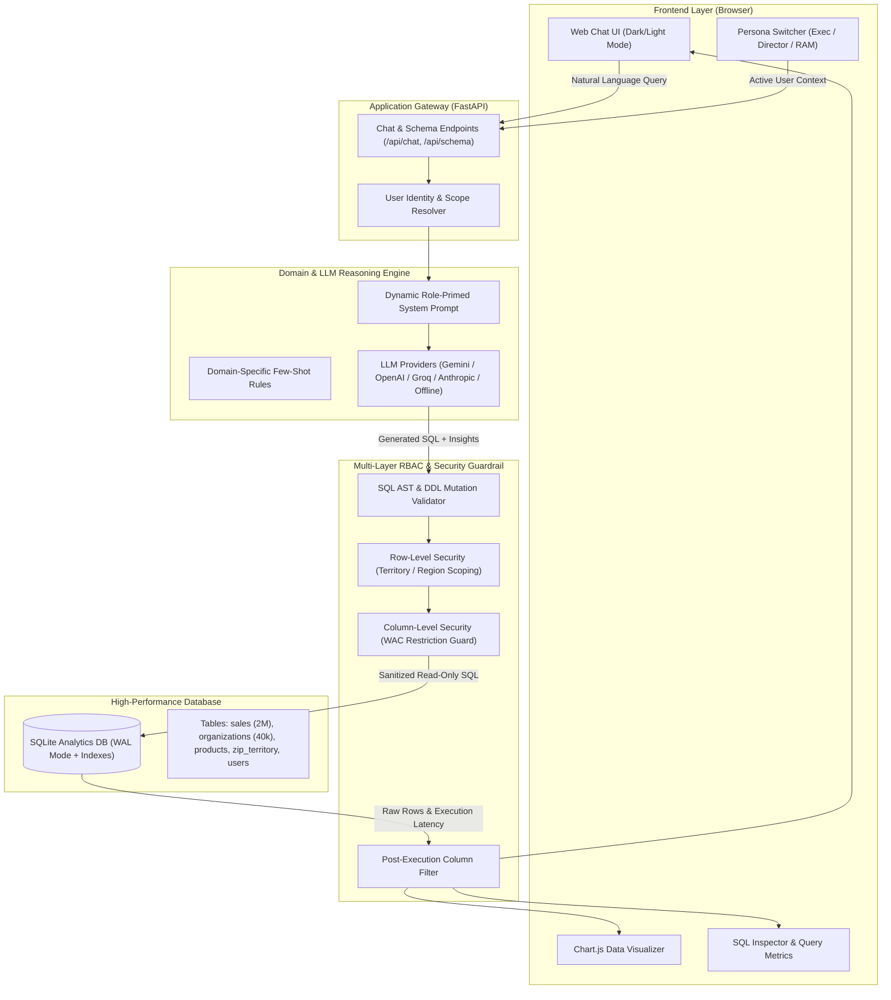
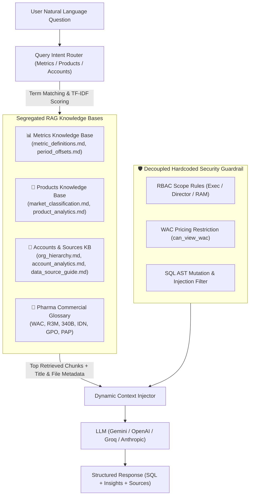

# NovaPharma Commercial Analytics Assistant — Design Document

## 1. Executive Summary

The **NovaPharma Commercial Analytics Assistant** is a production-grade Natural Language to SQL (NL-to-SQL) conversational AI system designed for pharmaceutical commercial analytics users (Executives, Regional Sales Directors, and Regional Account Managers). 

The system enables non-technical commercial users to ask complex analytical questions in plain English—such as market share dynamics, account rankings, 6-month product volume trends, and GPO affiliations—and immediately receive executive-ready answers, interactive visual charts, and structured tabular data with sub-millisecond query performance.

---

## 2. Architecture Overview

The system is structured as a decoupled, layered micro-architecture:



---

## 3. Database Choice and Optimization Rationale

### Choice: SQLite (with WAL Mode & Covered Indexes)
For local and containerized deployments, **SQLite** was chosen because:
1. **Zero-Overhead & Serverless Execution**: Eliminates network hop overhead; query execution runs in-process with under **1.5ms** query latency.
2. **ACID Compliance & WAL Mode**: Configured with `PRAGMA journal_mode = WAL;` and `PRAGMA synchronous = NORMAL;`, enabling concurrent reads without blocking.
3. **Compound Performance Indexing**:
   - `idx_sales_data_source`: on `sales(data_source, brand_flag)`
   - `idx_sales_mo_offset`: on `sales(mo_offset)`
   - `idx_sales_org_id`: on `sales(org_id)`
   - `idx_sales_ndc`: on `sales(ndc)`
   - `idx_org_zip`: on `organizations(zip)`
   - `idx_zip_territory`: on `zip_territory(territory_name, region_name)`

---

## 4. Domain Knowledge Integration

Pharmaceutical commercial data requires domain-specific reasoning that cannot be deduced from raw schema alone:

### A. Market Share Formula
* **Rule**: Market share is the ratio of NovaPharma distributor equivalents to total market volume equivalents for the same therapeutic category.
$$\text{Market Share} = \frac{\sum(\text{pack\_units} \times \text{unit\_conversion\_factor})_{\text{data\_source='distributor'} \land \text{brand\_flag=1}}}{\sum(\text{pack\_units} \times \text{unit\_conversion\_factor})_{\text{data\_source='market\_data'}}}$$
* The system constructs Common Table Expressions (CTEs) to independently aggregate the numerator (`distributor`) and denominator (`market_data`) without cross-contamination.

### B. Standardized Equivalents vs Pack Units
* Package sizes vary (e.g. 80MG vs 20MG vial). The engine applies `pack_units * unit_conversion_factor` to normalize dosages.

### C. Period Offsets over Date Math
* Rather than error-prone date arithmetic, the system prefers pre-computed offset columns:
  - `mo_offset = 0` (Current Month)
  - `mo_offset = 1` (Last Full Month)
  - `mo_offset IN (0, 1, 2)` (Rolling 3 Months / R3M)
  - `mo_offset IN (3, 4, 5)` (Prior 3 Months / R6M Comparison)

### D. Account Rollup Hierarchy
* Commercial analysts analyze accounts at the Integrated Delivery Network (IDN) or Health System level. The system uses:
  `COALESCE(o.grandparent_org_name, o.org_name) AS account_name`

### E. Free Drug Exclusion
* `data_source = 'hub_dispense'` has `wac = 0` and is excluded from paid demand / revenue queries unless free drug / PAP is explicitly requested.

---

## 4.1 Multi-Domain Knowledge Layer (RAG) Architecture

Rather than treating all documentation as a single monolithic block, NovaPharma Assistant incorporates a **Multi-Domain RAG Architecture** ([backend/rag_engine.py](file:///c:/Users/karti/Downloads/Projects/AI%20Slop/Pharma_Chatbot/backend/rag_engine.py)) that segregates distinct business documents into domain-specific knowledge bases:



### Key Architectural Tenets:

1. **Domain Segregation**:
   - `metrics`: Formulas for Market Share, Standardized Equivalents, Rolling 3M/6M offsets.
   - `products`: Product NDC mappings, therapeutic subcategories (Docetaxel, Carboplatin, etc.), dosing conversion factors.
   - `accounts_and_sources`: IDN grandparent hierarchy rollups, 340B entity flags, GPO affiliations, and data source rules (`distributor` vs `hub_dispense` vs `market_data`).
   - `glossary`: Instant lookup of commercial terms (WAC, PAP, 340B, IDN).

2. **Query Intent Domain Routing**:
   - When a user asks about *"market share for Zenovax"*, the router activates the `metrics` and `products` knowledge bases, preventing extraneous context from diluting the model prompt.

3. **Strict Decoupling of Security from RAG**:
   - **Critical Rule**: RBAC and WAC permissions are **NEVER** left to vector retrieval or LLM discretion.
   - Security constraints are hardcoded and enforced via pre-execution AST parsing and regex filters in [backend/security.py](file:///c:/Users/karti/Downloads/Projects/AI%20Slop/Pharma_Chatbot/backend/security.py), guaranteeing zero data leakage regardless of prompt injection or vector search results.

---

## 5. Security & Access Control Model (RBAC)

The application enforces a **defense-in-depth security model**:

| Feature | Exec | Director | RAM |
| :--- | :--- | :--- | :--- |
| **Geographic Scope** | Global (All Territories & Regions) | Assigned Region Only (e.g., *Northeast*) | Assigned Territory Only (e.g., *New York Metro*) |
| **WAC Pricing Visibility** | Full Access (`can_view_wac = 1`) | **Restricted** (`can_view_wac = 0`) | **Restricted** (`can_view_wac = 0`) |
| **Revenue Queries** | Gross Revenue via `SUM(wac)` | Blocked / Volume Alternatives offered | Blocked / Volume Alternatives offered |
| **Cross-Territory Access** | Permitted | Permitted within region | **Blocked** by security guardrail |

### Defense-in-Depth Mechanisms:
1. **Prompt Scoping**: Prompts are dynamically injected with exact territory/region constraints and role rules.
2. **Pre-Execution AST & Security Validator** ([backend/security.py](file:///c:/Users/karti/Downloads/Projects/AI%20Slop/Pharma_Chatbot/backend/security.py)):
   - Rejects non-SELECT queries (INSERT, UPDATE, DELETE, DROP, PRAGMA, etc.).
   - Disallows multi-statement execution.
   - For non-exec users, scans SQL for any references to `wac` and raises an access denial notice.
   - Validates that RAMs and Directors do not query unauthorized territories/regions.
3. **Post-Execution Column Scrubbing**: Automatically strips any sensitive columns from the API response payload if inadvertently produced.

---

## 6. LLM Engine & Pure Online Generation

The assistant features a strict multi-provider architecture ([backend/llm_engine.py](file:///c:/Users/karti/Downloads/Projects/AI%20Slop/Pharma_Chatbot/backend/llm_engine.py)) that relies entirely on real Large Language Models:
- **Supported Providers**: Google Gemini (`gemini-flash-latest`, `gemini-3.5-flash-lite`, `gemini-3.8-flash`), OpenAI (`gpt-4o-mini`), Groq (`llama-3.3-70b-versatile`), and Anthropic (`claude-3-5-sonnet`).
- **Strict API Key & Service Error Handling**: 
  - If no API key is provided or configured, the system immediately returns an explicit notice:
    `⚠️ Server not working: No API key found for <PROVIDER>. Please provide an API key in Settings.`
  - If the model service experiences network downtime or quota expiration, it reports the exact failure reason in the live interaction logs.
- **Output Format**: Structured JSON payload containing `sql`, `explanation`, `chart_type`, `x_key`, `y_keys`, and interactive `suggestions`.

---

## 7. Verification & Automated Test Suite

A comprehensive test suite is located in [tests/test_system.py](file:///c:/Users/karti/Downloads/Projects/AI%20Slop/Pharma_Chatbot/tests/test_system.py). Run tests with:

```bash
python -m unittest tests/test_system.py -v
```

### Verified Test Cases:
1. `test_01_database_tables`: Schema table integrity.
2. `test_02_user_profiles_and_roles`: Verification of 23 seeded user profiles and role attributes.
3. `test_03_sql_injection_and_mutations_blocked`: Injection, mutation, and multi-statement denial.
4. `test_04_wac_access_blocked_for_ram_and_director`: Enforcement of column-level WAC restriction.
5. `test_05_cross_territory_access_blocked_for_ram`: Row-level cross-territory denial.
6. `test_06_market_share_calculation`: Multi-source CTE market share accuracy.
7. `test_07_top_accounts_grandparent_aggregation`: IDN grandparent rollup validation.
8. `test_08_chat_endpoint_e2e_ram_volume_query`: End-to-end RAM volume chat query.
9. `test_09_chat_endpoint_e2e_ram_revenue_rejection`: End-to-end RAM revenue rejection notice.

---

## 8. Running Locally

### Quick Start:
```bash
# 1. Install dependencies
pip install -r requirements.txt

# 2. Start the local server
python run.py
```
Open **`http://localhost:8000`** in your browser.
