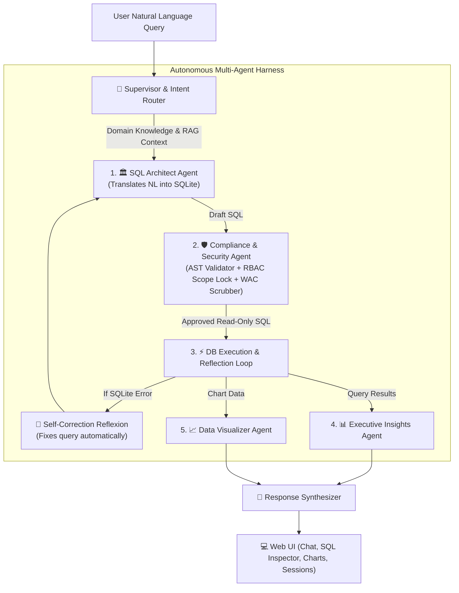

# Pharma Analytics Bot 🏥📊
### Enterprise Conversational AI for Commercial Intelligence (NL-to-SQL)

[](https://pharma-nl2sql-chatbot.onrender.com)
[](https://www.python.org/downloads/)
[](https://fastapi.tiangolo.com/)
[](https://www.sqlite.org/)
[](LICENSE)

**Live Cloud URL**: [https://pharma-nl2sql-chatbot.onrender.com](https://pharma-nl2sql-chatbot.onrender.com)

An end-to-end commercial analytics assistant built for pharmaceutical executives, regional sales directors, and account managers. It translates complex natural language business questions into precise, high-performance SQL queries over multi-source commercial datasets (sales, organizations, products, and sales territories).

---

## 🌟 Key Features

- **🤖 Multi-Agent Orchestration Harness**: 5 specialized agents for Intent Routing, SQL Architecture, Security Supervision, DB Execution Reflection, and Visual Analytics.
- **🛡️ Multi-Layer Security & RBAC Guardrails**:
  - **Exec**: Full visibility across all territories, regions, and sensitive pricing metrics (**WAC**).
  - **Director**: Scoped exclusively to assigned regions (**WAC pricing strictly hidden**).
  - **RAM (Account Manager)**: Scoped exclusively to assigned territory (**WAC pricing strictly hidden**).
- **📚 Domain Knowledge & RAG Reasoning**: Incorporates pharma commercial definitions—market share formulas, distributor vs. market data sources, NDC unit conversion factors, and brand filtering.
- **💬 Persistent Multi-User Session History**: ChatGPT-style left sidebar panel allowing users to save, switch, rename, and auto-title chat conversations across sessions.
- **📱 Mobile & Tablet Responsive**: Responsive interface with a collapsible hamburger navigation drawer and adaptive layouts for all screen sizes.
- **📈 Rich Visual Analytics**: Interactive Chart.js integration automatically renders trends, market share breakdowns, and top account rankings.
- **⚡ Sub-Millisecond Database Execution**: SQLite engine with optimized WAL mode, compound indexing, and zero-configuration bundled production auto-seeding.

---

## 🏗️ Architecture & How It Works



### Backend Components Breakdown (`backend/`)

- **[`app.py`](backend/app.py)**: FastAPI gateway serving REST endpoints (`/api/chat`, `/api/sessions`, `/api/schema`, `/api/logs`) and mounting the interactive static web interface.
- **[`agent_harness.py`](backend/agent_harness.py)**: Multi-agent supervisor orchestrating intent classification, domain prompt injection, query reflexion retries, and step-by-step execution tracing.
- **[`security.py`](backend/security.py)**: Compliance guardrail enforcing read-only AST query validation, row-level scope injection (territory/region constraints), and column-level WAC pricing restriction.
- **[`domain_knowledge.py`](backend/domain_knowledge.py)**: Rules engine storing DDL schema definitions, product classifications, market share SQL formulas, and commercial metrics guidance.
- **[`rag_engine.py`](backend/rag_engine.py)**: Lightweight semantic RAG vector engine providing contextual domain documentation during query generation.
- **[`db.py`](backend/db.py)**: High-throughput database layer managing SQLite connections, index initialization, schema queries, and persistent user session CRUD operations with idempotent auto-seeding.
- **[`llm_engine.py`](backend/llm_engine.py)**: Provider abstraction layer supporting Google Gemini, OpenAI, Groq, Anthropic, or local offline fallbacks.

---

## 🚀 Quickstart & Local Setup

### 1. Prerequisites
- Python 3.10+
- Git

### 2. Installation

```bash
# Clone the repository
git clone https://github.com/Vishwas27/pharma-nl2sql-chatbot.git
cd pharma-nl2sql-chatbot

# Create and activate virtual environment
python -m venv venv
# On Windows:
venv\Scripts\activate
# On Linux/macOS:
source venv/bin/activate

# Install dependencies
pip install -r requirements.txt
```

### 3. Environment Configuration
Create a `.env` file in the root directory:

```env
GOOGLE_API_KEY=your_gemini_api_key_here
PORT=8000
```

### 4. Run the Application

```bash
python run.py
```

Open your browser and navigate to: **`http://localhost:8000`**

---

## 🧪 Running Automated Tests

The repository includes a comprehensive system test suite verifying security guardrails, role access policies, domain rules, and query correctness:

```bash
python -m unittest tests/test_system.py
```

---

## ☁️ Cloud & Docker Deployment

### 1. Live Deployment on Render (Current)
The project is containerized with a production [`Dockerfile`](Dockerfile) and configured for continuous deployment on Render:
* **Live Service**: [https://pharma-nl2sql-chatbot.onrender.com](https://pharma-nl2sql-chatbot.onrender.com)
* **Build Command**: Automatically builds via Docker.
* **Environment Variables**: Set `GEMINI_API_KEY` in Render environment settings.

### 2. Run Locally with Docker Compose

```bash
docker-compose up -d --build
```

Access the application at `http://localhost:8000`.

### 3. Deploying to AWS (EC2 / App Runner)
For enterprise AWS deployments, refer to **[`DEPLOYMENT_AWS.md`](DEPLOYMENT_AWS.md)**.

---

## 📖 Comprehensive Documentation

For detailed technical specifications, database trade-offs, and security implementation details, refer to **[`DESIGN.md`](DESIGN.md)**.
